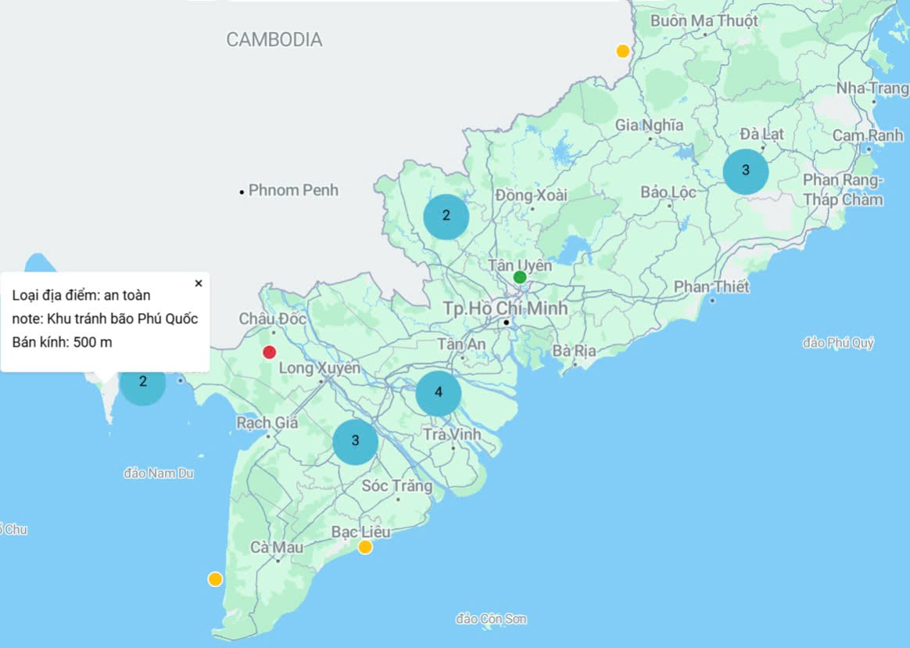
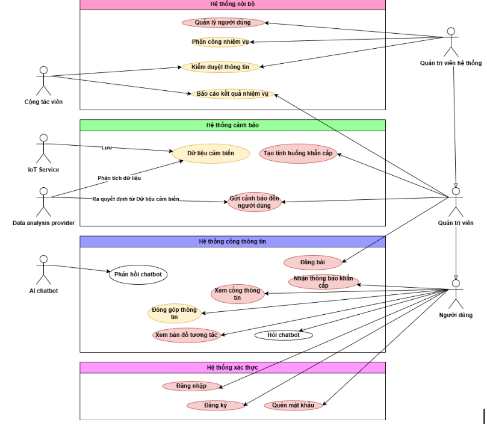

 

  

  <h3 align="center">Safe You Internals</h3>

  

   Phần mềm mã nguồn mở ở phía nội bộ cho Safe You  
     
    <a href="https://ute-safeyou.github.io/safeyou-docs/"><strong>Tài liệu phát triển internals»</strong></a>
     
     
    <a href="https://olp-asm.huuloc.id.vn/app/safeyou-internals/admin-authentication-67543a23fd51167a0308d7b7?branch=master">Online demo</a>
    ·
    <a href="https://github.com/othneildrew/Best-README-Template/issues/new?labels=bug&template=bug-report---.md">Báo cáo lỗi</a>
    ·
    <a href="https://github.com/othneildrew/Best-README-Template/issues/new?labels=enhancement&template=feature-request---.md">Yêu cầu tính năng</a>
  

## Về Safe You Internals 👋

Safe You Team đã xuất ra `safeyou-internals.json` để bạn có thể import và phát triển theo cách của bạn.
Bạn có thể xem hướng dẫn cách import tại đây: [Hướng dẫn import](https://ute-safeyou.github.io/safeyou-docs/)

(<a href="#readme-top">trở lên đầu</a>)

## Danh mục 📋

<!-- TABLE OF CONTENTS -->

  
Mục lục

  <ol>
    <li>
      <a href="#xây-dựng-với">Nền tảng phát triển</a>
    </li>
    <li>
      <a href="#chức-năng-chính">Chức năng chính</a>
    </li>
    <li><a href="#hướng-dẫn-cài-đặt">Hướng dẫn cài đặt</a></li>
    <li><a href="#tài-liệu-kỹ-thuật">Tài liệu kỹ thuật</a></li>
    <li><a href="#lộ-trình">Lộ trình</a></li>
    <li><a href="#đóng-góp-cho-dự-án">Đóng góp cho dự án</a></li>
    <li><a href="#giấy-phép">Giấy phép</a></li>
    <li><a href="#liên-hệ">Liên hệ</a></li>
  </ol>

### Nền tảng phát triển

Để hoàn thiện nền tảng, Safe You Team sử dụng các công nghệ sau:

#### Phần mềm mã nguồn mở sử dụng

- [Appsmith](https://www.appsmith.com/) - Nền tảng phát triển Low-Code hiện đại (Giấy phép Apache 2.0)
- [Supabase](https://supabase.com/) - Nền tảng cung cấp cơ sở dữ liệu, giao tiếp thời gian thực và AI (Giấy phép Apache 2.0)
- [Strapi](https://strapi.io/) - Hệ thống quản lý nội dung Headless CMS mã nguồn mở (Giấy phép MIT Expat)
- [RabbitMQ](https://www.rabbitmq.com/) - Hệ thống xử lý hàng đợi tin nhắn mã nguồn mở (Giấy phép Mozilla Public License 2.0)
- [N8N](https://n8n.io/) - Hệ thống quản lý quy trình làm việc (Giấy phép Sustainable 1.0)
- [Docker](https://www.docker.com/) - Nền tảng phát triển ứng dụng container (Giấy phép Apache 2.0)

#### Ngôn ngữ lập trình, thư viện, framework và cơ sở dữ liệu

- [Node.js](https://nodejs.org/) - JavaScript runtime (Giấy phép MIT)
- [React](https://reactjs.org/) - JavaScript library for building user interfaces (Giấy phép MIT)
- [Express](https://expressjs.com/) - Web framework for Node.js (Giấy phép MIT)
- [PostgreSQL](https://www.postgresql.org/) - Cơ sở dữ liệu mã nguồn mở (Giấy phép PostgreSQL)
- [Deno](http://deno.land/) - Secure runtime for JavaScript and TypeScript (Giấy phép MIT)

#### Dịch vụ bên thứ 3

- [Geocode.map API](https://geocode.xyz/) - Dịch vụ cung cấp thông tin địa lý
- [Goong API](https://docs.goong.io/) - Dịch vụ cung cấp bản đồ Việt Nam và thế giới
- [Azure AI API](https://azure.microsoft.com/en-us/services/cognitive-services/) - Dịch vụ cung cấp AI và Machine Learning của Microsoft
- [Twilio SMS](http://twilio.com/) - Dịch vụ cung cấp SMS và gọi điện thoại để gửi cảnh báo đến người dùng
- [Gmail SMTP](https://developers.google.com/gmail/api) - Dịch vụ gửi email thông báo đến người dùng
- [Gemini AI](https://gemini.google.com/) - Safe You dùng mô hình vector embedding text-embedding-004 của Google để hỗ trợ tìm kiếm tài liệu
- [Appsmith AI](https://appsmith.com/) - Dịch vụ cung cấp LLM của Appsmith

(<a href="#readme-top">trở lên đầu</a>)

### Chức năng chính

#### 1. Đối với người dùng

1.1. Bản đồ tương tác

- Hiển thị vùng bị ảnh hưởng và các trung tâm hỗ trợ, khu vực an toàn.
  1.2. Nhận cảnh báo: Nhận cảnh báo theo vị trí GPS thời gian thực để người dân ứng phó và bảo vệ bản thân.
  1.3. Chợ tình thương:
- Hỗ trợ nhân đạo sau thảm họa
- Cung cấp nhu yếu phẩm giữa người cho và người nhận dễ dàng. 💖
  1.4. Tình nguyện:
- Cho đi là còn mãi, Safe You cung cấp cho người dùng cơ hội được trở thành tình nguyện viên dễ hơn.
  1.5. Cập nhật thông tin:
- Tổng hợp nguồn tin tức tin cậy
- Hướng dẫn an toàn đến từ Safe You
  1.6. Đóng góp thông tin
- Điền form, gắn tag (yêu cầu hỗ trợ, thông tin về thiệt hại, thông tin về tình huống khẩn cấp, phân loại theo khu vực,...)

#### 2. Đối với quản trị viên

2.1. Gửi cảnh báo đến người dùng
Tính năng này sẽ gửi cảnh báo thông qua: SMS, Email (hoặc gọi điện). Tích hợp hệ thống cảnh báo theo vị trí địa lý (geofencing) để gửi thông báo đến đúng khu vực bị ảnh hưởng.
Tùy chọn gửi của Admin gồm có:

- Admin gửi theo vùng
- (Giới hạn vùng được gửi)

  2.2. Phân công nhiệm vụ

* Tự động cập nhật tin tức (đổ data từ báo chính thống)

  2.3. Tạo tình huống khẩn cấp
  Tạo thông tin về khẩn cấp để thông báo

  2.4. Báo cáo hoạt động

  2.5. Đăng bài viết hỗ trợ người dùng

Phân tích nghiệp vụ bài toán qua Use-case diagram của nhóm

### Hướng dẫn cài đặt

Dưới đây là hướng dẫn ngắn cách cài đặt hệ thống.

1. Cài đặt các công cụ cần thiết:

- AppSmith: [Hướng dẫn cài đặt AppSmith](https://docs.appsmith.com/getting-started/installation)
- Supabase: [Hướng dẫn cài đặt Supabase](https://supabase.io/docs/guides/with-react)
- Strapi: [Hướng dẫn cài đặt Strapi](https://strapi.io/documentation/developer-docs/latest/getting-started/quick-start.html)
- RabbitMQ: [Hướng dẫn cài đặt RabbitMQ](https://www.rabbitmq.com/download.html)
- N8N: [Hướng dẫn cài đặt N8N](https://docs.n8n.io/getting-started/installation)
- Docker: [Hướng dẫn cài đặt Docker](https://docs.docker.com/get-docker/)
- Node.js: [Hướng dẫn cài đặt Node.js](https://nodejs.org/en/download/)
- React: [Hướng dẫn cài đặt React](https://reactjs.org/docs/getting-started.html)
- Express: [Hướng dẫn cài đặt Express](https://expressjs.com/en/starter/installing.html)
- PostgreSQL: [Hướng dẫn cài đặt PostgreSQL](https://www.postgresql.org/download/)

2. Hướng dẫn cách chạy hệ thống:
   Để biết thêm thông tin chi tiết, bạn có thể xem tài liệu kỹ thuật của Safe You tại [đây](https://ute-safeyou.github.io/safeyou-docs/).

(<a href="#readme-top">trở lên đầu</a>)

## Tài liệu kỹ thuật

Safe You sử dụng Mkdocs để tạo tài liệu kỹ thuật. Bạn có thể xem tài liệu kỹ thuật của Safe You tại [đây](https://ute-safeyou.github.io/safeyou-docs/).

(<a href="#readme-top">trở lên đầu</a>)

<!-- ROADMAP -->

## Lộ trình

- [x] Phát triển hệ thống cảnh báo
- [x] Hệ thống tình nguyện viên
- [x] Hệ thống chợ tình thương
- [x] Hệ thống cập nhật thông tin
- [x] Hệ thống đóng góp thông tin
- [x] Hệ thống gửi cảnh báo đến người dùng
- [x] Hệ thống phân công nhiệm vụ
- [ ] Tích hợp phân tích dữ liệu
- [ ] Tích hợp hệ thống nguồn mở với thiết bị IoT

Bạn có thể xem [issues](https://github.com/UTE-SafeYou/UTE-SafeYou/issues) để biết thêm danh sách các tính năng được đề xuất (và các vấn đề đã biết).

(<a href="#readme-top">trở lên đầu</a>)

<!-- CONTRIBUTING -->

## Đóng góp

Những đóng góp quý báu của bạn làm cho cộng đồng mã nguồn mở trở nên tuyệt vời hơn. Mọi đóng góp bạn đều được đánh giá cao và Safe You rất biết ơn về điều đó.

Nếu bạn có đề xuất nào giúp dự án trở nên tốt hơn, hãy fork dự án và tạo một pull request. Bạn cũng có thể đơn giản mở một issue với tag "enhancement" hoặc ấn vào các đường dẫn sau:

1. Báo cáo lỗi: [Báo cáo lỗi](https://github.com/UTE-SafeYou/safeyou-internals/issues/new?assignees=&labels=&projects=&template=b%C3%A1o-c%C3%A1o-l%E1%BB%97i.md&title=báo-cáo-lỗi)
2. Yêu cầu tính năng: [Yêu cầu tính năng](https://github.com/UTE-SafeYou/safeyou-internals/issues/new?assignees=&labels=&projects=&template=y%C3%AAu-c%E1%BA%A7u-t%C3%ADnh-n%C4%83ng.md&title=)

Ngoài Github, Safe You cũng se tổng hợp các lỗi và hướng dẫn hỗ trợ [tại đây](https://docs.google.com/spreadsheets/d/16oQy8kBOMlrbtV0BpOXKJEzr7BDqgaNaqXXxt4xpibk/edit?usp=sharing)

<!-- LICENSE -->

## Giấy phép

Sau khi tham khảo, nhóm Safe You quyết định sử dụng giấy phép [GNU - General Public License v3.0]().

(<a href="#readme-top">trở lên đầu</a>)

<!-- CONTACT -->

## Liên lạc

Chúng tôi luôn sẵn sàng hỗ trợ bạn bất cứ khi nào
[Facebook](https://www.facebook.com/safeyouteam)

Ngoài ra bạn cũng có thể gửi email cho Safe You Team qua địa chỉ: `safeyouteam@gmail.com`

Các lập trình viên của khởi đầu dự án Safe You:

- Trần Công Toản - [tctoan1024@gmail.com](mailto:tctoan1024@gmail.com)
- Lâm Hoài Kim Ngân - [22133036@student.hcmute.edu.vn](mailto:22133036@student.hcmute.edu.vn)
- Nguyễn Hữu Lộc - [22110179@student.hcmute.edu.vn](mailto:22110179@student.hcmute.edu.vn)

(<a href="#readme-top">trở lên đầu</a>)

